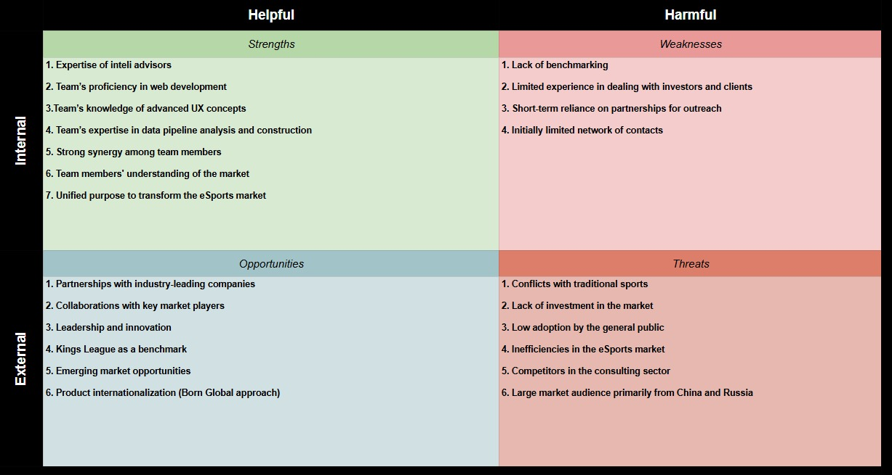
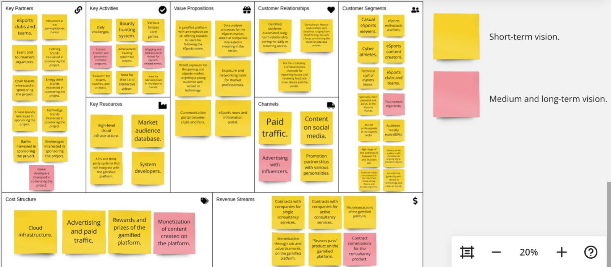
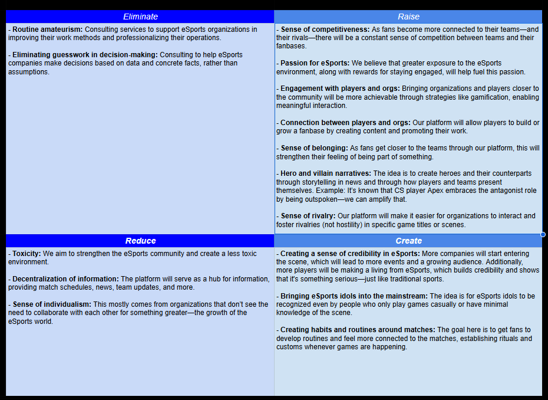

# Report - Module 1

## Module Overview
This module was dedicated to product development and product-market fit assessment. Our efforts were directed toward collecting insights from both eSports market professionals and fans, while simultaneously developing business materials to support strategic planning. By combining these two fronts, we were able to refine our approach, validate key hypotheses, and discard less viable ideas. The results were highly satisfactory: we confirmed the relevance of most of our initial assumptions, gained greater clarity on the project’s development path, and established valuable connections with industry professionals who may contribute to the project's growth in future stages.

## Project Overview

### Problem Identification

The central thesis of this project highlights the inefficiency of organizations in strategically leveraging their existing audience as a driver of organic marketing, as well as their limited capacity to convert products and services into tangible results. The fragmentation of tools used to interact with fan communities further undermines competitiveness and hampers the implementation of effective engagement strategies. Moreover, the absence of standardized solutions for data collection and analysis prevents the formation of a cohesive ecosystem, thereby restricting monetization opportunities and audience retention.

Additionally, it was observed that many organizations lack the technical expertise required to interpret and capitalize on the data they already possess. This limitation obstructs the transformation of valuable information into actionable business opportunities. The issue is particularly evident in sponsor relations, where there is often a lack of clear metrics to evaluate return on investment or to segment target audiences effectively. This scenario not only discourages potential sponsors from entering the eSports market but also leads to intense competition among clubs for the same sponsors, thereby constraining financial growth.

Another critical challenge lies in the lack of professionalism in key industry domains such as data analysis and strategic management. Passion for the sport is frequently unaccompanied by the requisite skills to ensure efficient and sustainable operations, ultimately impeding the development of a more robust and mature industry. The shortage of specialized talent, coupled with the lack of structured tools for data handling, prevents organizations from formulating effective strategies for engagement, monetization, and organic growth.

### Proposed Solution

In light of this context, there is a pressing need to develop solutions that address these challenges while fostering more strategic and data-driven management practices. To this end, we propose the development of an integrated platform that incorporates gamification mechanisms, rewarding users for their continued engagement with club content and promoting sustained interaction. The implementation of analytical tools for data collection and interpretation will enable organizations to gain deeper insights into their audience and operations, leading to more efficient decision-making. Furthermore, by facilitating a clearer understanding of audience profiles and providing measurable sponsorship outcomes, the proposed solution seeks to create a more attractive environment for new sponsors and unlock greater growth potential for teams and businesses within the eSports ecosystem.

The platform will centralize fan-club interactions, providing an environment where users can follow their favorite teams, participate in challenges, earn points, and redeem rewards through a structured loyalty system. These activities will generate behavioral data that, when properly analyzed, can guide strategic decisions related to content, communication, and community-building efforts. For clubs, this means having access to a comprehensive dashboard with real-time metrics on user engagement, growth trends, and campaign performance.

From a business standpoint, the solution will serve as a bridge between organizations and potential sponsors by offering audience segmentation tools, ROI tracking, and sponsorship activation analytics. This allows sponsors to make data-informed decisions and tailor their investments to clubs or games that align with their target demographics. By enhancing transparency and measurability, the platform reduces entry barriers for new sponsors and creates long-term value for existing partnerships.

In terms of technology, the platform will be built with scalability and interoperability in mind. Through API integrations, clubs will be able to connect their existing systems—such as social media, content platforms, and merchandise stores—allowing for a seamless experience and richer data collection. Additionally, the solution will feature a modular architecture, enabling organizations of varying sizes and technical maturity to adopt the platform according to their needs.

Ultimately, this initiative aims to professionalize audience engagement and data usage within the eSports industry, empowering clubs to grow organically, optimize their revenue streams, and build lasting relationships with both fans and sponsors.

## Artifacts

### 1. Business Plan

#### Swot Analysis

#### Business Model Canvas

#### Risk Matrix

#### Blue Ocean Strategy

### 2. Interview Reports

#### Interview Booking

#### Interview Template

#### Interviews Report

### 3. Market Validation

#### Product Adhesion Forms

#### Product Adhesion Results

### 4. Macro Definition

#### Gamefied App

#### eSports Consulting Product

## New Insights
Throughout our research, we identified numerous needs expressed by both professionals and fans. These insights will be essential for developing new ideas and reinforcing the foundations of our current concepts.

- Sponsors represent the top-of-funnel market.

- The market is highly passionate but exhibits a frustrating lack of professionalism.

- The emotions experienced by spectators and those who work to foster competitiveness are truly unparalleled.

- Effectively leveraging fans' desire for exhibitionism and stimulating the competitive spirit of proving who is the most devoted supporter is crucial.

- Large clubs derive approximately 30% of their revenue from merchandising.

- Publishers consistently seek to expand their competition calendar but require serious organizations and well-executed projects.

- The market, in general, is poorly collaborative.

- There is a significant lack of tools in the industry, both for data analysis and for assisting professionals in their daily operations.

- Most eSports companies struggle with organizational culture issues.

- Organizations lack precise knowledge of their fan base size.

- There is a substantial opportunity to leverage partner organizations for our own brand promotion.

- There is a need for more information about the games the audience watches, such as schedules, statistics, and general details.

- Research indicates that viewers struggle to find where to watch matches or follow championship stages.

- Top players are not well connected to the community.

- Some viewers have difficulty finding updates on team changes, such as player transfers and roster acquisitions.

- Most fans would like more interviews with coaches and players.

- The top priority for our app should be a well-designed UI to ensure a smooth and enjoyable daily user experience.

- LAN events and online events feel fundamentally different.

- The production quality of LAN events is generally superior to online ones.

- Even without a live audience, playing in a LAN environment provides a better competitive experience.

## Next Steps

For the next module, our focus will be on developing the core features of our application and conducting private testing to evaluate the effectiveness of the user experience. In parallel, we will finalize all functional requirements, implement the DevOps infrastructure, and define key security measures, while also advancing the design phase. Additionally, we plan to launch our company’s content creation strategy, producing materials that showcase the app’s main features and help strengthen our brand identity. Lastly, we will continue expanding our professional network through interviews and strategic connections, maintaining a forward-looking approach to the development of our consulting product.