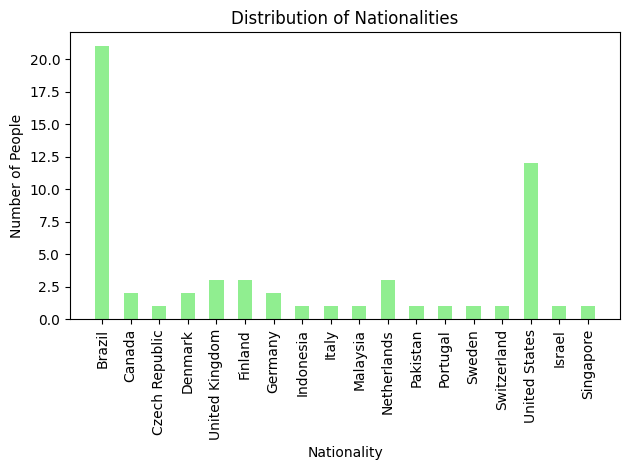
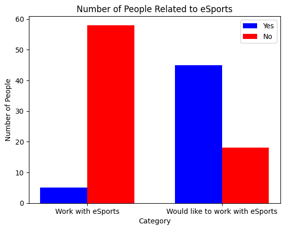
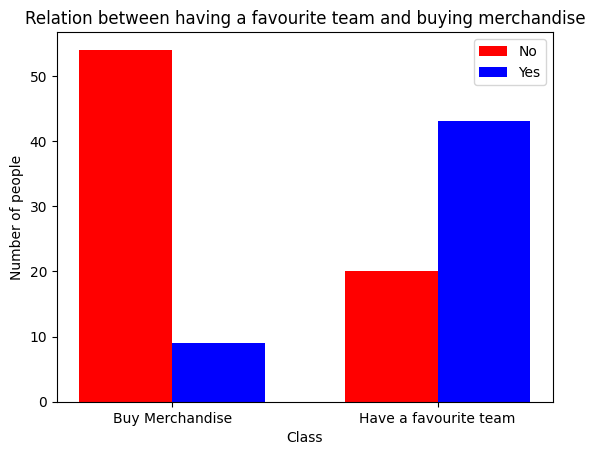
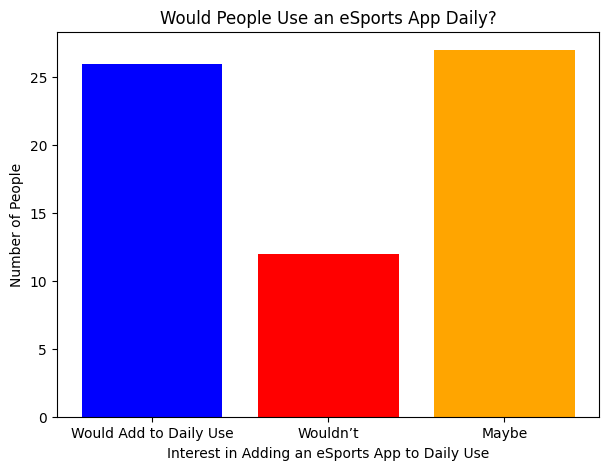

# Report - Module 1

## Module Overview
This module was dedicated to product development and product-market fit assessment. Our efforts were directed toward collecting insights from both eSports market professionals and fans, while simultaneously developing business materials to support strategic planning. By combining these two fronts, we were able to refine our approach, validate key hypotheses, and discard less viable ideas. The results were highly satisfactory: we confirmed the relevance of most of our initial assumptions, gained greater clarity on the project’s development path, and established valuable connections with industry professionals who may contribute to the project's growth in future stages.

## Project Overview

### Problem Identification

The central thesis of this project highlights the inefficiency of organizations in strategically leveraging their existing audience as a driver of organic marketing, as well as their limited capacity to convert products and services into tangible results. The fragmentation of tools used to interact with fan communities further undermines competitiveness and hampers the implementation of effective engagement strategies. Moreover, the absence of standardized solutions for data collection and analysis prevents the formation of a cohesive ecosystem, thereby restricting monetization opportunities and audience retention.

Additionally, it was observed that many organizations lack the technical expertise required to interpret and capitalize on the data they already possess. This limitation obstructs the transformation of valuable information into actionable business opportunities. The issue is particularly evident in sponsor relations, where there is often a lack of clear metrics to evaluate return on investment or to segment target audiences effectively. This scenario not only discourages potential sponsors from entering the eSports market but also leads to intense competition among clubs for the same sponsors, thereby constraining financial growth.

Another critical challenge lies in the lack of professionalism in key industry domains such as data analysis and strategic management. Passion for the sport is frequently unaccompanied by the requisite skills to ensure efficient and sustainable operations, ultimately impeding the development of a more robust and mature industry. The shortage of specialized talent, coupled with the lack of structured tools for data handling, prevents organizations from formulating effective strategies for engagement, monetization, and organic growth.

### Proposed Solution

In light of this context, there is a pressing need to develop solutions that address these challenges while fostering more strategic and data-driven management practices. To this end, we propose the development of an integrated platform that incorporates gamification mechanisms, rewarding users for their continued engagement with club content and promoting sustained interaction. The implementation of analytical tools for data collection and interpretation will enable organizations to gain deeper insights into their audience and operations, leading to more efficient decision-making. Furthermore, by facilitating a clearer understanding of audience profiles and providing measurable sponsorship outcomes, the proposed solution seeks to create a more attractive environment for new sponsors and unlock greater growth potential for teams and businesses within the eSports ecosystem.

The platform will centralize fan-club interactions, providing an environment where users can follow their favorite teams, participate in challenges, earn points, and redeem rewards through a structured loyalty system. These activities will generate behavioral data that, when properly analyzed, can guide strategic decisions related to content, communication, and community-building efforts. For clubs, this means having access to a comprehensive dashboard with real-time metrics on user engagement, growth trends, and campaign performance.

From a business standpoint, the solution will serve as a bridge between organizations and potential sponsors by offering audience segmentation tools, ROI tracking, and sponsorship activation analytics. This allows sponsors to make data-informed decisions and tailor their investments to clubs or games that align with their target demographics. By enhancing transparency and measurability, the platform reduces entry barriers for new sponsors and creates long-term value for existing partnerships.

In terms of technology, the platform will be built with scalability and interoperability in mind. Through API integrations, clubs will be able to connect their existing systems—such as social media, content platforms, and merchandise stores—allowing for a seamless experience and richer data collection. Additionally, the solution will feature a modular architecture, enabling organizations of varying sizes and technical maturity to adopt the platform according to their needs.

Ultimately, this initiative aims to professionalize audience engagement and data usage within the eSports industry, empowering clubs to grow organically, optimize their revenue streams, and build lasting relationships with both fans and sponsors.

## Artifacts

### 1. Business Plan

#### Overview
We developed a business plan that integrates multiple business model templates and market analyses to support the strategic direction of the company. This document helps us reinforce our strengths, address our weaknesses, and ensure we remain aligned with our core purpose and value proposition.

#### PDF

### 2. Interview Reports

#### Interview Booking

We scheduled five interviews with professionals working in various areas of the eSports industry, including data analysts, former professional players, staff members, casters, broadcast coordinators, and relationship coordinators. These individuals represent five different organizations, ranging from game publishers to eSports teams. Our goal was to engage with professionals who could complement our understanding of how eSports companies make decisions and define their strategies. Through these conversations, we were able to validate many of our initial hypotheses while also gaining valuable insights and new ideas based on current market needs and strengths.

#### Interview Template

We structured our reusable interview report template into three parts, aiming for a 25 to 30-minute interview:

Project Pitch Deck and Context, along with Our Presentation (5 min): In this section, we aim to observe the person's reaction to the project, also paying attention to non-verbal cues to understand their thoughts and feelings about it.

Interviewee Presentation (5 min): We ask the person about their daily work, seeking insights into the market, visible pain points they experience, and potential opportunities we can explore. This also helps us get to know the interviewee better.

Market Validation Questions (15–20 min): We select three key questions based on the person's role and expertise. During this section, we take detailed notes on their answers, as well as any additional insights their responses may provide.

Extra: If time permits, we will ask an additional key question or, as a secondary option, allow the interviewee to ask us any questions.

#### Interviews Report

For this module, we formulated 13 key questions addressing the main gaps we identified in our project. These questions guided our interviews, helping us not only gather valuable insights but also successfully find answers to all of them. This process provided us with a clearer perspective on the next steps and the ideas we plan to develop. The questions covered a range of topics, including legal issues, market success, growth potential and profitability, pain point validation, and target audience.

### 3. Product Adhesion Research 

#### Product Adhesion Forms

We developed two Google Forms — one in English and one in Portuguese — to collect responses from potential users. The goal was to assess fan satisfaction with their experience as eSports enthusiasts, evaluate their openness to incorporating an eSports app into their daily routine, and gather demographic data. We successfully received over 60 responses from fans of 15 different games, spanning more than 15 countries across 4 continents.

Both forms remain open, and if you are interested in eSports, we encourage you to participate and share your perspective!

- <a href="https://forms.gle/pBgrtJCaJ8wqcfDV7">English Forms </a>
 
- <a href="https://forms.gle/bWMdr3GsoAEzXfJH8">Portuguese Forms </a>

#### Product Adhesion Results

We were able to collect several valuable insights, including users’ preferred methods for consuming eSports content, their relationship with and perceptions of the industry, and more. Below are four key insights we would like to highlight:

1. Countries Distribution: Acquiring geographic information is important to us since we aim to launch our product globally. Therefore, we tracked responses by country to ensure our research reached most continents. A quick disclaimer: the goal is not to measure which region has the most eSports fans but rather to assess whether we are reaching a broad global audience.

2. Interest in Working in eSports vs. Current Industry Professionals: We cross-referenced two sets of data, one asking people if they had ever considered working in eSports, and the other asking if they currently work in the industry. This led us to discover a low conversion rate, where many people interested in eSports did not actually enter the market.

3. Favorite Teams vs. Merchandise Purchases: We made a relation between people who have a favourite team, and people who buy stuff from those teams. We believed that if someone has a favourite team they are more likely to buy stuff from them, something that was proved false

4. Possible Product Adhesion: Finally, we wanted to measure how open people would be to using an eSports app on a daily basis. We concluded that most users' willingness will depend on how good the app is.

### 4. Macro Definition

#### Gamefied App

 We have planned for the game app the main activities, which will encompass a diverse range of features, including interactive games, informational content, news updates, professional development tools, and a dedicated marketplace.

#### eSports Consulting Product

For the consulting part of the project, we have categorized the different services we can offer to various types of customers, such as data analysis services, eSports business consulting, and hosting our own events.

#### Content

In the content creation section, we aim to cover a wide range of content relevant to the eSports community, including game analysis, various types of interviews, and eSports news.

#### Games in Focus

We mapped out the major 16 games we aim to cover, selecting them based on the strength and activity of their competitive scenes. Our decision to prioritize these titles is based on a trade-off between each game's relevance and our team's familiarity with them. Additionally, we’ve deferred coverage of games that would likely require content production in Asian languages for a later stage.

## New Insights
Throughout our research, we identified numerous needs expressed by both professionals and fans. These insights will be essential for developing new ideas and reinforcing the foundations of our current concepts.

- Sponsors represent the top-of-funnel market.

- The market is highly passionate but exhibits a frustrating lack of professionalism.

- The emotions experienced by spectators and those who work to foster competitiveness are truly unparalleled.

- Effectively leveraging fans' desire for exhibitionism and stimulating the competitive spirit of proving who is the most devoted supporter is crucial.

- Large clubs derive approximately 30% of their revenue from merchandising.

- Publishers consistently seek to expand their competition calendar but require serious organizations and well-executed projects.

- The market, in general, is poorly collaborative.

- There is a significant lack of tools in the industry, both for data analysis and for assisting professionals in their daily operations.

- Most eSports companies struggle with organizational culture issues.

- Organizations lack precise knowledge of their fan base size.

- There is a substantial opportunity to leverage partner organizations for our own brand promotion.

- There is a need for more information about the games the audience watches, such as schedules, statistics, and general details.

- Research indicates that viewers struggle to find where to watch matches or follow championship stages.

- Top players are not well connected to the community.

- Some viewers have difficulty finding updates on team changes, such as player transfers and roster acquisitions.

- Most fans would like more interviews with coaches and players.

- The top priority for our app should be a well-designed UI to ensure a smooth and enjoyable daily user experience.

- LAN events and online events feel fundamentally different.

- The production quality of LAN events is generally superior to online ones.

- Even without a live audience, playing in a LAN environment provides a better competitive experience.

## Next Steps

For the next module, our focus will be on developing the core features of our application and conducting private testing to evaluate the effectiveness of the user experience. In parallel, we will finalize all functional requirements, implement the DevOps infrastructure, and define key security measures, while also advancing the design phase. Additionally, we plan to launch our company’s content creation strategy, producing materials that showcase the app’s main features and help strengthen our brand identity. Lastly, we will continue expanding our professional network through interviews and strategic connections, maintaining a forward-looking approach to the development of our consulting product.