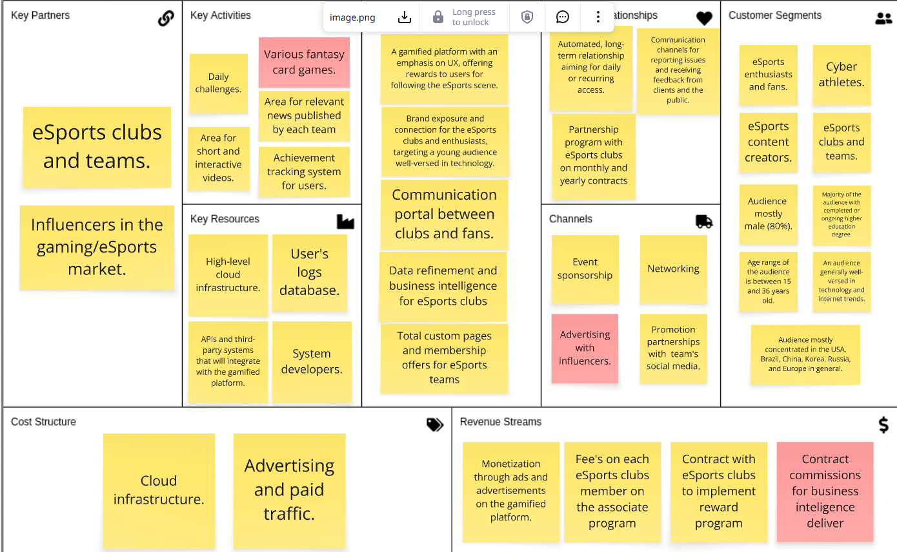

# Report - Module 2

## Module Overview

This module was initially intended to focus on designing and developing the app. However, after the first sprint, we decided to pivot our solution from an informational app to a fan club platform tailored for digital sports teams. This decision came after identifying weaknesses in our initial thesis and uncovering new opportunities, which led us to shift our strategy toward a B2B model. As a result, several adjustments were made to the project plan, raising new questions and requiring updates to our business documents. 

## Project Pivoting

### Strategic Pivot Based on Mentor Insights

Following a series of insightful meetings with the mentors provided by Inteli and our academic advisor, we made the strategic decision to pivot from our project's current conceptual direction during this sprint. This decision was informed by the identification of certain structural weaknesses in our thesis, challenges in user acquisition, and the emergence of new opportunities previously overlooked. Among the key drivers behind this pivot was the difficulty of overcoming the network effect inherent in existing services. Many of the features we had envisioned for the informational aspect of the platform would be forced to compete in a saturated space: news, event updates, and player/match data, without offering a sufficiently differentiated value proposition. Our original solution did not intend to cover such a broad range of content, thereby limiting the incentive for users to transition from established platforms. Furthermore, regarding gamification, we recognized a missed opportunity in capitalizing on the monetization potential of such features, for both our business and for partner clubs. The rewards and incentive system we had previously proposed failed to effectively address the core user pain points in a meaningful or scalable way.

### Emerging Opportunity: B2B Ecosystem for eSports Fan Memberships

We have identified a promising opportunity in the B2B space: building a digital ecosystem tailored to fan membership programs for eSports clubs. Our platform enables new revenue streams and strengthens fan engagement by offering gamified experiences and providing clubs with actionable insights into both paying members and the wider audience.

At the core of our strategy is the idea of leveraging each club’s fanbase and brand to drive user acquisition and participation. Clubs retain full control over the rewards and benefits they offer, ensuring autonomy and alignment with their community. Our role is to provide the underlying technology and tools — allowing clubs to launch and manage these programs efficiently, without needing to build the infrastructure themselves.

## Artifacts

### 1. Business Model Canvas

We revised all segments of the Business Model Canvas, primarily by streamlining features, resources, and customer segments that are no longer directly targeted by our product. We maintained the differentiation of yellow post-its for immediate actions and red post-its for activities planned for a slightly longer timeframe.

### 2. User Research Forms

Our survey featured several questions that we formulated to better understand the current relationship between fans and clubs. We also included questions aimed at identifying the best strategies to deliver an optimal experience for the fans. These are the asked questions:

#### 1. Where are you from?

#### 2. Do you have an favorite esports team?

#### 3. Which team(s) is your favorite?

#### 4. How do you usually engage with your favorite eSports team or with eSports teams in general?

#### 5. Have you ever bought merchandise from your favorite team?

#### 6. Have you ever participated in any initiatives to financially support your team? (e.g., membership programs, exclusive events)

#### 7. If your favorite team offered a membership program (where you earn rewards during your membership), would you be interested in signing up?

#### 8. Which rewards would you be interested in receiving through a membership program?

#### 9. How much would you be willing to pay for a monthly subscription? (Keep in mind that the higher the subscription fee, the better the rewards you can earn.)

#### 10. Would you be interested in subscribing to more than one membership program?

#### 11. Would you be interested in connecting with fan members from other teams to interact, compete, and showcase your badges and ranks?

#### 12. Which activities would you be willing to participate in on the app? (Keep in mind that each activity you complete will help you progress in your rewards, similar to a battle pass.)

### 3. Interviews with professionals

We scheduled two interviews with professionals working in marketing of two different eSports teams. Our goal was to engage with professionals who could complement our understanding of how eSports companies make decisions and define their strategies, aiming to gather insights for our project from the perspective of someone who works at a major eSports club. Through these conversations, we were able to validate many of our pivoting hypotheses while also gaining valuable insights and new ideas based on current market needs and strengths, that would later inspire a feature for the fans and be another revenue source.

#### Interview Template

We structured our reusable interview report template into three parts, aiming for a 25 to 30-minute interview:

- Project Pitch Deck and Context, along with Our Presentation (5 min): In this section, we aim to observe the person's reaction to the project, also paying attention to non-verbal cues to understand their thoughts and feelings about it.

- Interviewee Presentation (5 min): We ask the person about their daily work, seeking insights into the market, visible pain points they experience, and potential opportunities we can explore. This also helps us get to know the interviewee better.

- Market Validation Questions (15–20 min): We select three key questions based on the person's role and expertise. During this section, we take detailed notes on their answers, as well as any additional insights their responses may provide.

- Extra: If time permits, we will ask an additional key question or, as a secondary option, allow the interviewee to ask us any questions.

#### Interviews Report

For this module, we formulated 28 key questions addressing areas we do not fully comprehend yet. These questions guided our interviews, helping us not only gather valuable insights but also successfully find answers to all of them. This process provided us with a clearer perspective on the next steps and the ideas we plan to develop. The questions covered a range of topics, focusing mainly on target audience, pain point validation, types of engagement and business models.